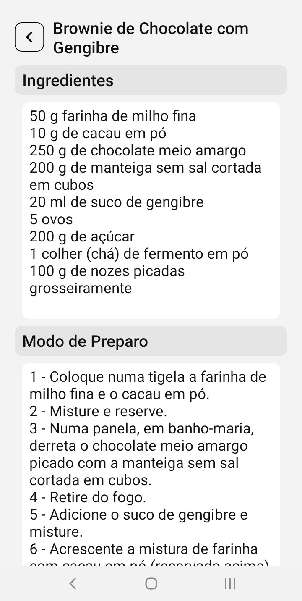

# APP de Receitas

## Sobre

Este é um aplicativo desenvolvido em React Native & Expo, para listar uma serie de receitas culinárias. O backend responsavel por alimentar o app também é autoral (foi desenvolvido um BFF), e conta com mais de 100 Receitas oriundas de um JSON alimentado por scrapping e povoamento manual.  

### 📋 Lista de features

- [x] Lista de Receitas
- [x] Busca de Receita
- [x] Receitas separadas pela Letra Inicial
- [x] Página de Detalhes da Receita com Ingredientes, Modo de Preparo e Rendimento nas receitas que possuem a informação disponivel.

## 📱​ Telas do projeto



### 🔧 Instalação

Instalando as dependencias:

```
npm install
```

Rodando o projeto:

```
npm run start
```

### 💭​ Observações

O Aplicativo esta na sua v1, então provavelmente pode passar por melhorias funcionais e estéticas.

## ✒️ Autor

* **Daniel Nogueira** - *Web Developer* - [Github](https://github.com/NogueiraDan)

